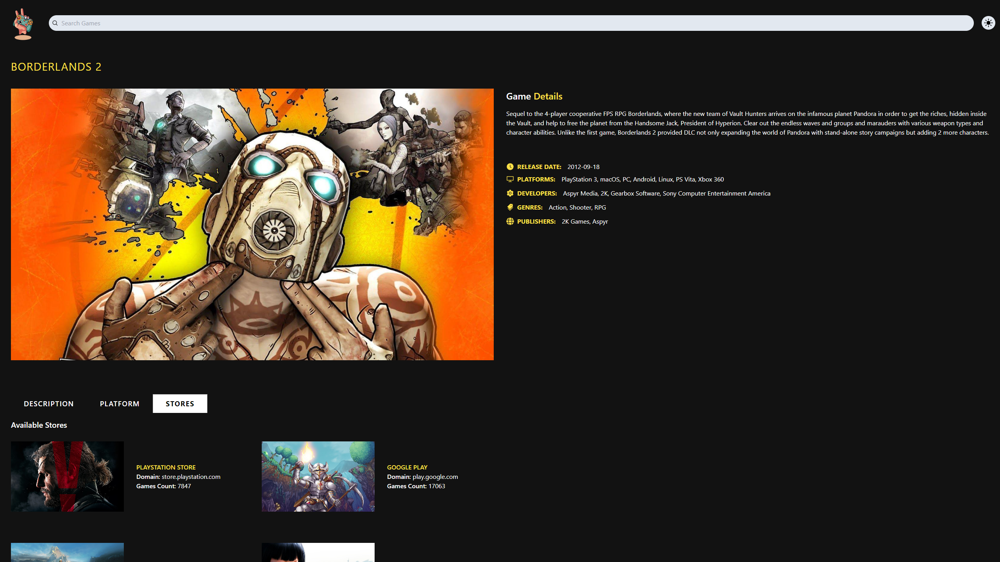

<br/>
<div align="center">
  <a href="">
    
  </a>

  <h1 align="center">Games Search Engine</h1>

  <p align="center">
    <a href="https://discover-games-react-ts-rf.netlify.app/" target="_blank"><strong>Live Website »</strong></a>
    <br/>
    <br/>
  </p>
</div>

<details>
  <summary>Table of Contents</summary>
  <ol>
    <li>
      <a href="#about-project">About Project</a>
    </li>
    <li>
      <a href="#screenshots">Screenshots</a>
    </li>
    <li><a href="#tech-stack">Tech Stack</a></li>
    <li>
      <a href="#installation">Installation</a>
    </li>
  </ol>
</details>
 <br />

## About Project

A website designed to find games and get detailed information about them. Created using React JS, TypeScript and designed using Tailwind CSS. Website is fully responsive and based on fetching data using Axios from an API. It allows you to search for games by name, filter games by category, and display detailed information about games, all dynamically generated via queries to the API.

## Screenshots





## Tech Stack

- 
- 
- 
- 
- Axios
- Context API
- React Icons

## Installation

To get started with this project, simply clone the repository:

```bash
git clone https://github.com/Vertori/games-app-react-ts.git
```

To setup API, go to [Rawg IO API Website](https://rawg.io/apidocs) and create an account.<br/>
Copy your Rapid API Key<br/>
Create .env file in root folder<br/>
Paste your API Key to your .env file as shown below

```bash
VITE_GAMES_API_KEY = 'Your API Key'
```

Use the package manager [npm](https://www.npmjs.com/) to install the dependencies.

```bash
npm install
```

After that, run the following command to start the development server:

```bash
npm run dev
```
